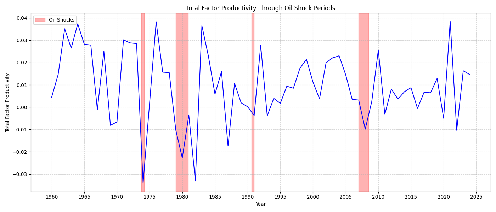

## Welcome to the Labour Market segment

This section explores the labour market, beginning with the production function and extending to key issues such as employment, unemployment, and productivity.

**Overview**

We start with the theoretical foundations of production and labour demand, before moving into real-world applications involving labour dynamics and macroeconomic shocks.

### Mini Project: With the War in Iran and the closure of the Strait of Hormuz sparking an energy crisis. How will this affect the Total Factor Productivity? What are the potential knock-on effects?

**Approach**

1. Conduct a comparative analysis using historical oil shocks
2. Apply a probabilistic framework to account for uncertainty
3. Use regression techniques to estimate relationships between energy prices and TFP

This project draws on methods from ST3131: Regression Analysis.

### Notable Textbook Insights

**Key takeaways from Abel, Bernanke, and Croushore — Macroeconomics:**

1. **Oil Shocks and the Effects on Total Factor Productivity**
   

**Description**

The oil shock periods recorded are: 
1.  1973 Oil Embargo (Yom Kippur War)
→ Oct 1973 – Mar 1974

1979 Iranian Revolution / Iran–Iraq War
→ Jan 1979 – Dec 1980

1990 Gulf War (Invasion of Kuwait)
→ Aug 1990 – Jan 1991

2000s Oil Price Surge (Pre–Great Recession Peak)
→ Jan 2007 – Jul 2008

**Observations**

A sharp decline in Total Factor Productivity (TFP) is observed during each of these oil shock periods.

**Economic Interpretation**

This pattern aligns with standard economic intuition:

* Oil price increases raise energy costs of production
* Higher costs lead to an increase in firms’ marginal cost
* Profit-maximising firms respond by reducing output

As a result, there is a negative relationship between energy prices and economic output.

Using the production function:

  <em>Y = A · F(K, N)</em>

(Y): Output (K): Capital (N): Labour (A): Total Factor Productivity (TFP)

Energy price shocks are captured within TFP (A), as they affect overall production efficiency.

Thus, the observed decline in TFP during oil shocks reflects the adverse impact of rising energy costs on aggregate output.
